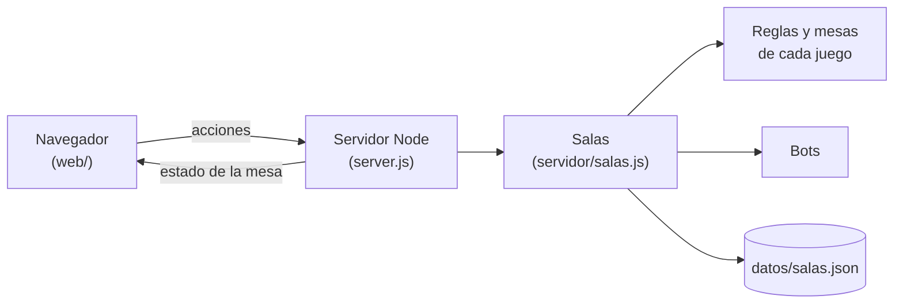

# Arquitectura

### Cómo se reparte el trabajo

¿Qué hace el servidor y qué hace el navegador?

```mermaid
flowchart LR
    N["Navegador<br/>(web/)"] -->|"acciones"| S["Servidor Node<br/>(server.js)"]
    S -->|"estado de la mesa"| N
    S --> L["Salas<br/>(servidor/salas.js)"]
    L --> M["Reglas y mesas<br/>de cada juego"]
    L --> B["Bots"]
    L --> D[("datos/salas.json")]
```
