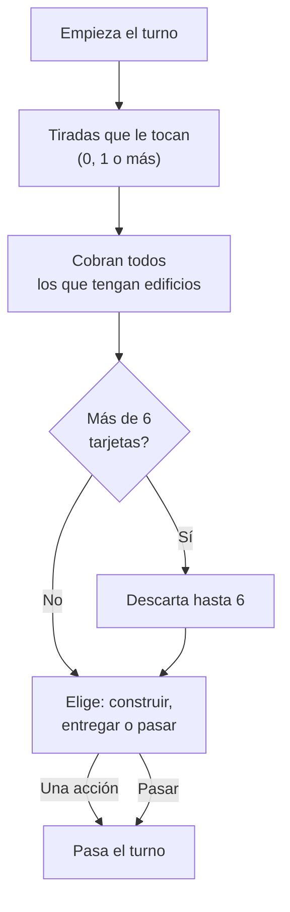

# Turno de Fundación

### Un turno de Fundación

¿Qué pasa desde que empieza un turno hasta que pasa al siguiente jugador?

```mermaid
flowchart TD
    A["Empieza el turno"] --> B["Tiradas que le tocan<br/>(0, 1 o más)"]
    B --> C["Cobran todos<br/>los que tengan edificios"]
    C --> D{"Más de 6<br/>tarjetas?"}
    D -->|"Sí"| E["Descarta hasta 6"]
    D -->|"No"| F["Elige: construir,<br/>entregar o pasar"]
    E --> F
    F -->|"Una acción"| G["Pasa el turno"]
    F -->|"Pasar"| G
```
